# 장은재 - 코멘토 프론트엔드 직무부트캠프 수강 후기

## 코멘토 직무부트캠프

<p align="center"></p>

<p align="center"></p>


<aside>

https://comento.kr/edu/learn/ITSW/%EC%9B%B9%EA%B0%9C%EB%B0%9C-G2446

</aside>

> 코멘토  프론트엔드 직무부트캠프
> 
- 드림패스 비교과 프로그램에서 신청
- 기간: 약 4~5주 과정(OT 포함)
    - 매주 금요일까지 과제 제출
    - 2주차/4주차 일요일에 Zoom 비대면 발표
- 과제 및 질문 제출 → 피드백 → 반영

### |  왜 들었나요?

- 내 코드가 괜찮은지 스스로 판단하기 어려웠다
    - 뭘 고쳐야 하는지 모르겠다는 생각을 자주 했다
- 현직자에게 1:1 피드백을 받아 **`적절한 코드`**가 뭔지 기준을 잡고 싶었다
- **실무 경험(개발 → 문서화)**을 과제로 경험해보기 좋을 것 같았다

### |  나의 수강 목표

- **코드** : 내 코드의 문제점이 무엇인지 알아내자!
- **피드백**: 제출했던 과제의 피드백을 다음 과제에 반영하자!
- **문서화**: 내가 개발한 내용을 설명할 줄 알자!

---

## |  4주 동안 한 과제 요약

[https://github.com/eae22/comento_bootcamp_front](https://github.com/eae22/comento_bootcamp_front)

> **1주차: 개발환경 + 자기소개 페이지**
> 
- GitHub 레포 생성
- HTML/CSS로 자기소개 페이지 제작

> **2주차: 레이아웃**
> 
- 지뢰찾기/자판기/계산기 중 1개 선택
    
    → 화면만 구성(HTML/CSS), 기능 구현 X
    
- (선택) 개념 조사
- 해당 내용 발표
    
    → 따로 발표 자료 제작 X, 웹페이지/코드 화면공유
    

> **3주차: 이벤트 있는 웹 페이지 2개**
> 
- Project#1 시계: 배터리 감소/0% 처리/알람(최대 3개)/추가 기능
- Project#2 계산기: 키패드/연산/결과/초기화/추가 기능
- 각 프로젝트별로 문서화
- (선택) 개념 조사

> **4주차: 신입사원 프로젝트**
> 
- Project#1 To-Do-List: 일정 추가/삭제
- Project#2 회원가입: 아이디 중복체크/비밀번호 규칙 검증
- 각 프로젝트별로 문서화
    - 문서작성 예시 파일
        
        [장은재_4주차_project2_문서작성.pdf](./image/%E1%84%8C%E1%85%A1%E1%86%BC%E1%84%8B%E1%85%B3%E1%86%AB%E1%84%8C%E1%85%A2_4%E1%84%8C%E1%85%AE%E1%84%8E%E1%85%A1_project2_%E1%84%86%E1%85%AE%E1%86%AB%E1%84%89%E1%85%A5%E1%84%8C%E1%85%A1%E1%86%A8%E1%84%89%E1%85%A5%E1%86%BC.pdf)
        
- 해당 내용 발표
    
    → 따로 발표 자료 제작 X, 웹페이지/코드/문서 화면공유
    

---

### |  업무 요청서 + 결과물 + 업무 보고 예시

> 2주차 업무 요청서
> 

<p align="center">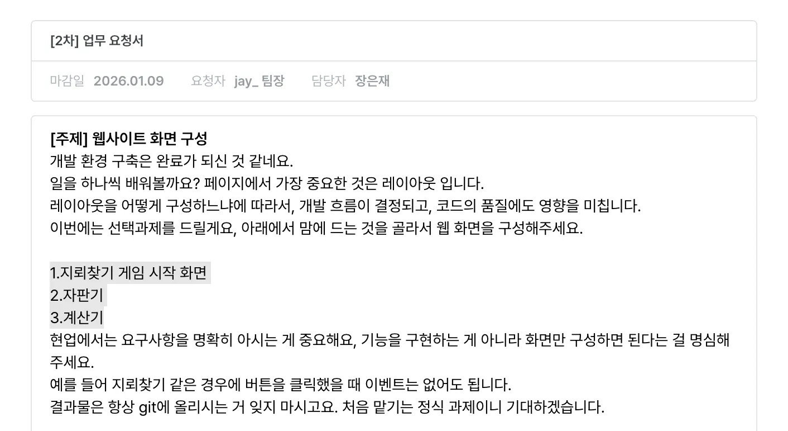</p>

<p align="center">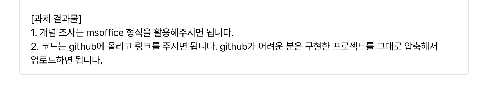</p>

- 과제는 `업무 요청서` 형태로 확인 가능했다
- 1~2주차: 큰 틀만 주어지고, 세부 요청 사항은 없었다
    - 예시
        
        1주차: 자기소개 페이지
        
        2주차: 지뢰찾기/자판기/계산기 중 택 1
        
- 3~4주차: 기능 요구사항(FR)은 구체적으로 주어졌고, 구현 방식은 자율이었다
    - 예시
        
        3주차: 시계(배터리/알람/추가 기능) + 계산기(연산/초기화/추가 기능)
        
        4주차: To-Do-List(일정 추가/삭제) + 회원가입(아이디 중복체크/비밀번호 규칙 검증)
        

> 2주차 결과물
> 

<p align="center">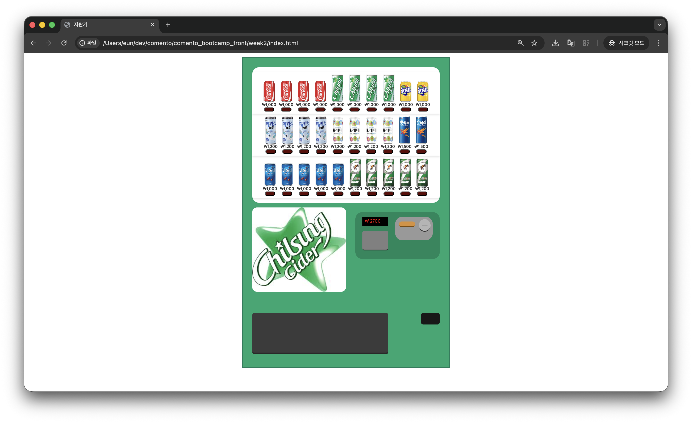</p>

- 지뢰찾기/자판기/계산기 중 **자판기**를 선택했다
- 기능 구현 없이 HTML/CSS로 레이아웃만 구성하는 것이 과제였다
- 큰 틀(영역 분리) → 정렬/간격까지 레이아웃 설계를 연습했다

> 2주차 업무 보고
> 

<p align="center">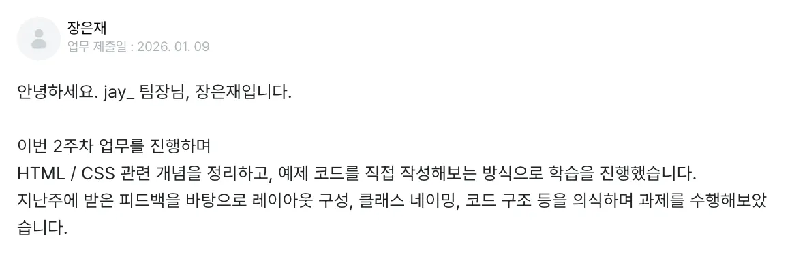</p>

<p align="center">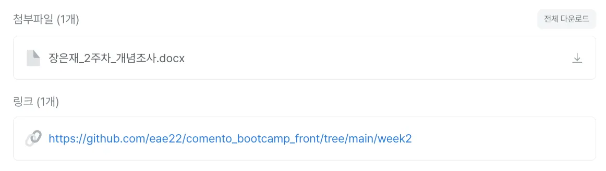</p>

- 매주 과제는 **업무 보고 글** + 첨부파일(문서) +  GitHub  링크 형태로 제출했다
    - **업무 보고 글**에는 해당 주차 **진행 방식/고민/질문**을 정리했다

---

### |  피드백 방식

- 매주 과제 제출 후 **1~2일 이내**에 피드백 자료를  **PPT** 로 받았다

1) 멘티 전체 피드백(공통)

<p align="center">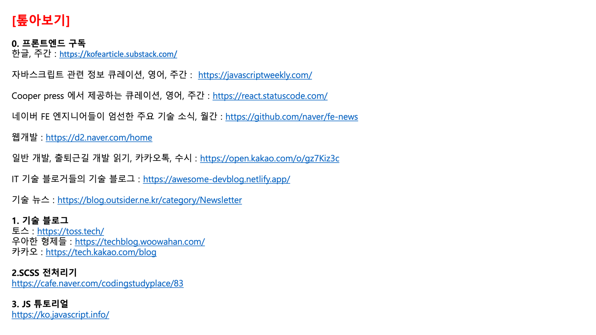</p>

<p align="center">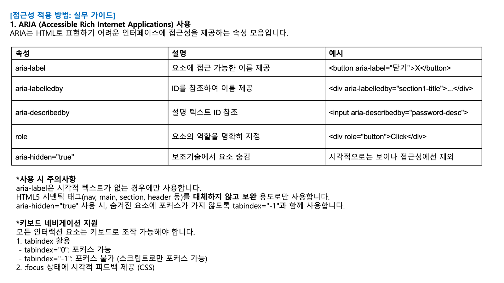</p>

- ‘톺아보기’처럼 **참고 `링크/자료`를 모아서 공유**
- 접근성(ARIA) 같은 주제로 **`핵심 개념 정리` 내용 공유**

2) 개인 피드백(개별)

<p align="center">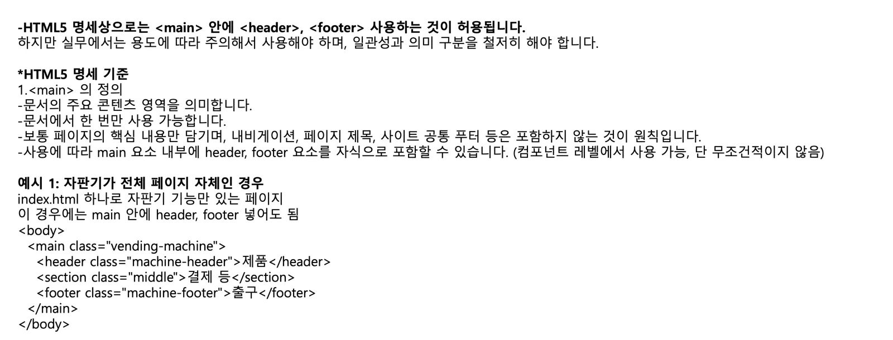</p>

<p align="center">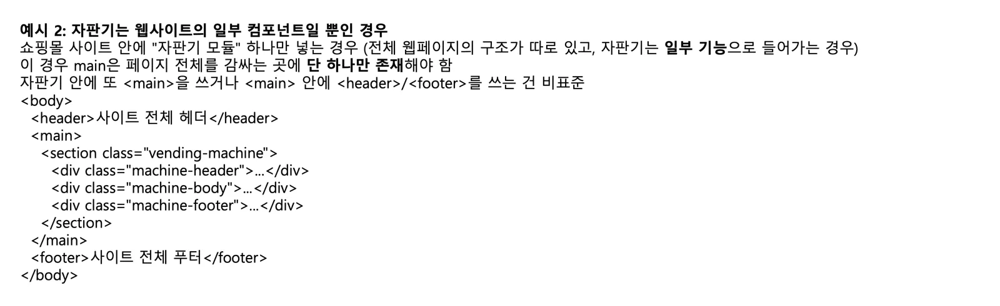</p>

<p align="center">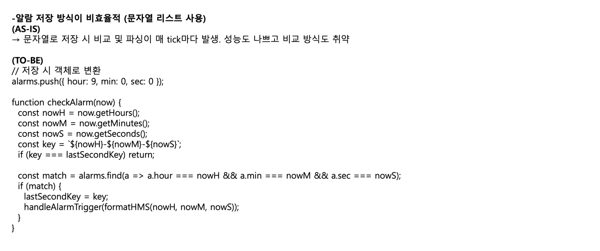</p>

- 내가 제출한 과제와 질문을 바탕으로
    - **질문에 대한 답변**
    - 과제에서 **잘못된 점 / 개선하면 더 좋은 점**
    - 추가로 보면 좋은 **참고 방향(키워드/자료)**
        
        를 함께 정리해주셨다
        
- 특히 **`AS-IS → TO-BE`** 형태로 “왜 문제인지 / 어떻게 바꾸면 좋은지”가 같이 제시돼서 명확했다
    - 의미
        
        **`AS-IS`**: 현재의 상태나 모습
        
        **`TO-BE`**: 미래의 이상적인 상태나 목표
        

---

### |  피드백으로 바뀐 코드1  Before / After

> Before  week3_시계
> 

```
let battery = 100;
let alarms = [];
let batteryTimer = null;
let clockTimer = null;
let lastSecondKey = '';
```

- **week3_시계**: 모든 상태를 전역에 선언
- 빠르게 구현하려고 상태를 전역 변수로 뒀다

> 피드백
> 

<p align="center">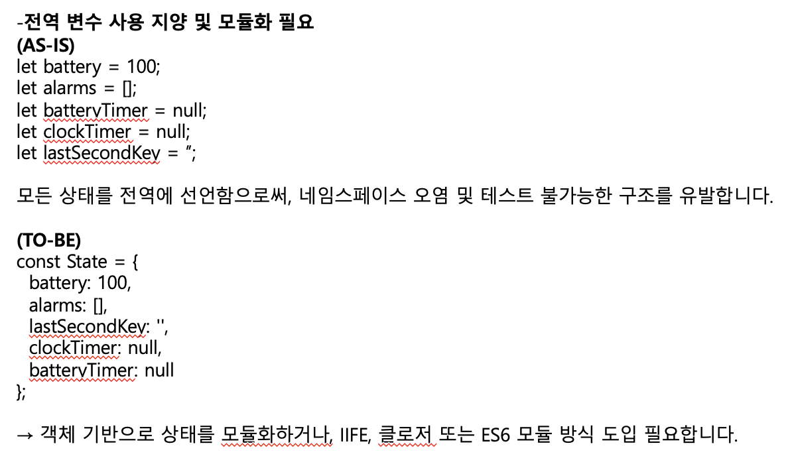</p>

- 피드백을 통해 전역 상태가 커질수록 **의존성이 늘고 수정 범위가 넓어지는 문제**가 생긴다는 걸 알게 됐다

> After  week4_회원가입
> 

```jsx
const State = {
      users: [], // { id, pw, createdAt }
      idChecked: false,
      checkedIdValue: '',
    };
```

- **week4_회원가입**: 피드백 반영해 State라는 객체 하나로 묶어서 관리

---

### |  피드백으로 바뀐 코드2  Before / After

> Before  week3_시계
> 

```jsx
function tickClock() {
  // 배터리 0이면 시계 OFF
  if (battery <= 0) {
    setClockOff(true);
    return;
  }

  setClockOff(false);

  const now = new Date();
  $clockText.textContent = formatDateTime(now);
  const secondKey = `${now.getFullYear()}-${
    now.getMonth() + 1
  }-${now.getDate()}-${now.getHours()}-${now.getMinutes()}-${now.getSeconds()}`;
  if (secondKey === lastSecondKey) return;

  const nowHMS = formatHMS(now.getHours(), now.getMinutes(), now.getSeconds());
  if (alarms.includes(nowHMS)) {
    lastSecondKey = secondKey;
    flashAlarm();
    alert(`알람 ${nowHMS}`);
  }
}
```

- **week3_시계**: tickClock() 함수에 로직(시간 계산) + View 업데이트 + 부수효과(alert/flash)가 섞여 있었다

> 피드백
> 

<p align="center">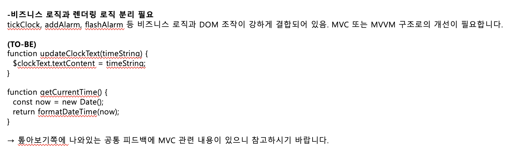</p>

- 로직과 화면 업데이트가 한 함수에 섞여 있으면 수정/테스트가 어려워지므로, **역할을 분리(MVC)해보라는 피드백을 받았다**
    - **MVC란?**
        
        > **MVC(Model–View–Controller)**
        > 
        - **Model**: 데이터 및 로직을 관리
            
            예) 현재 계산 수식 (3 + 5 * 2) 또는 결과값
            
        - **View**: 사용자에게 보여지는 화면(UI)
            
            예) HTML의 <div id=“display”>와 버튼들
            
        - **Controller**: 사용자 입력을 받아서 처리하고, Model과 View를 연결
            
            예) 버튼 클릭 시 appendValue(), calculate() 등의 함수 실행
            
        
        > 동작 흐름
        > 
        - 사용자 입력 → **Controller**(이벤트 처리) → **Model(데이터** 변경) → **View**(화면 업데이트)
    
    **Q. 왜 세세하게 분리하나요?**
    
    - 로직이랑 화면 코드가 섞이면 코드가 금방 복잡해짐
    - 나눠두면 **수정/확장**할 때 덜 꼬이고, **테스트**도 쉬워짐
    - 4주차 발표에서
        
        나: 어느 정도까지 쪼개야 할 지 모르겠다
        
        멘토님: 최대한으로 쪼개는 게 맞다
        

> After  week4_To-Do-List
> 

```jsx
const State = {
      todos: [], // { id, text, done, createdAt }
    };
```

- **Model**: 화면과 분리된 ‘할 일 목록' 데이터를 State에서 한 번에 관리했다

```jsx
function render() {
	renderList();
	renderMeta();
	renderEmpty();
}
```

- **View**: 화면 업데이트는 render()가 전담하고, 세부 화면은 renderList/renderMeta/renderEmpty로 나눴다.

```jsx
function handleSubmit(e) {
      e.preventDefault();

      const text = $input.value;
      const error = validateTodoText(text);
      if (error) {
        setMessage(error, 'error');
        return;
      }

      addTodo(text.trim());     // 입력값(공백) 정리 -> Model(State) 변경
      $input.value = '';
      setMessage('추가되었습니다.');
      render();                 // View 갱신
}
```

- **Controller**: 사용자 입력을 받아 **검증 → 상태 변경 → 화면 갱신(render)** 흐름을 담당한다
- **week4_To-Do-List**: 피드백을 바탕으로 Model/Controller/View 역할을 나눠보는 방식으로 구조를 정리했다

---

### |   총평

<aside>

- **현직자 피드백(코드+문서화)** 덕분에 “이게 맞나?”하던 답답함이 많이 풀림
- 피드백 반영하면서 **코드가 실제로 좋아지는 경험**을 함
- 같은 요청서라도 자율이라 **결과물이 다양하게 나옴**을 발표로 체감함
</aside>

> 좋았던 점
> 

<aside>

- **피드백이 구체적**: 생각 못 한 개선 포인트를 정확히 짚어줌
- **문서화까지 피드백**: 실무식 정리 흐름을 배움
- **비교 학습 가능**: 다른 멘티 결과물 + 피드백까지 함께 확인
- **주 1회 과제**라 부담이 크지 않았음
</aside>

> 아쉬웠던 점
> 

<aside>

- **짧은 기간(4주)**: JS는 3~4주차 중심이라 깊게 가긴 어려웠음
- **진로 확신까진 X**: 도움/체험엔 좋지만 결정적이진 않음
- 구조에 집중하다 보니, **기능도 다양하게 추가해볼걸** 하는 아쉬움이 남음
</aside>

---

<aside>

> 수료증
> 

<p align="center">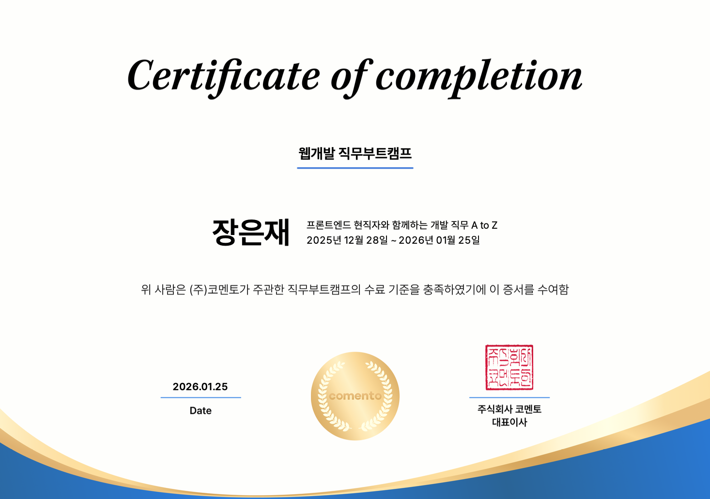</p>

</aside>